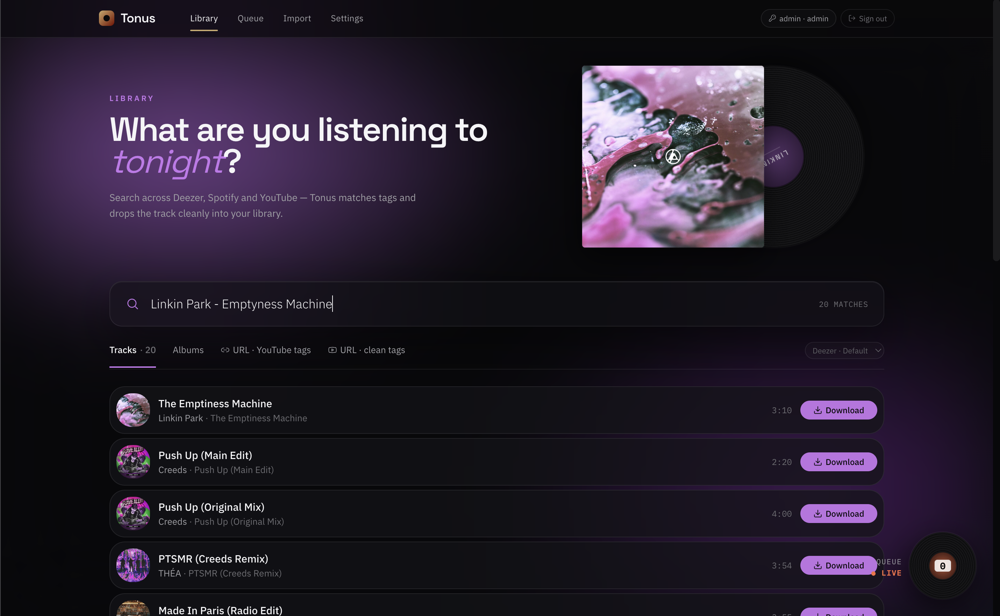
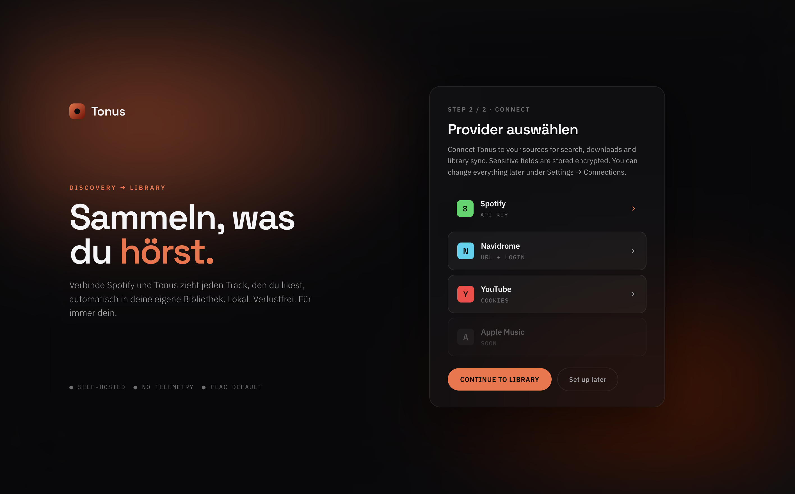
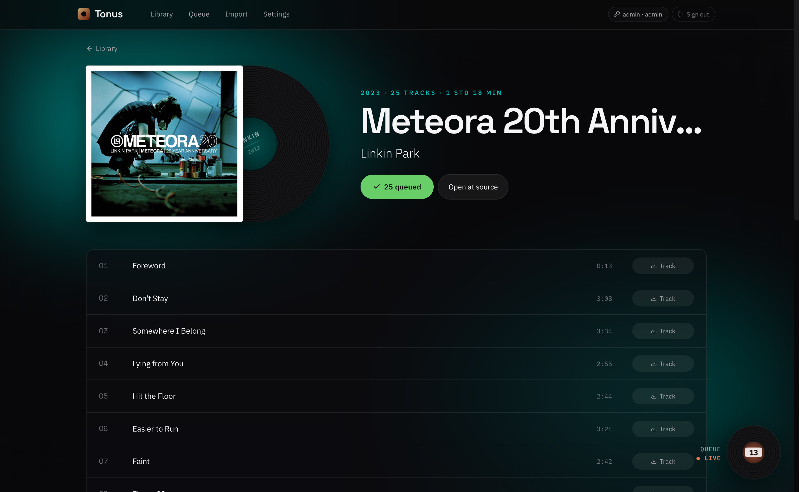
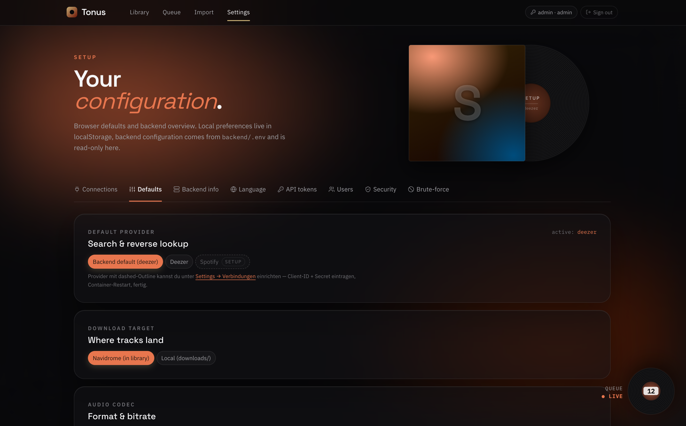
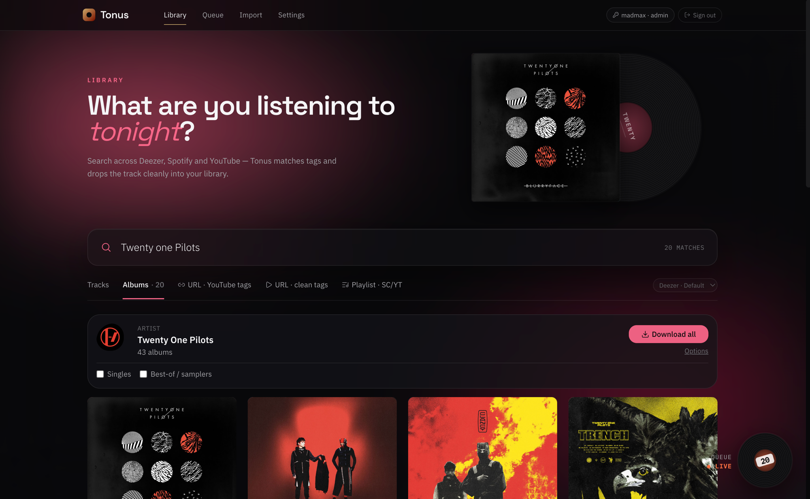

<p align="center">
  
</p>

<p align="center">
  <strong>Self-hosted music acquisition for Navidrome.</strong><br/>
  Multi-user from day one — 2FA, encrypted secrets, per-user access tokens. Spotify, Deezer or YouTube as source.
</p>

<p align="center">
  <a href="LICENSE"></a>
  <a href="https://github.com/madmax1301/tonus/actions/workflows/test.yml"></a>
  <a href="https://github.com/madmax1301/tonus/actions/workflows/build.yml"></a>
  <a href="https://github.com/madmax1301/tonus/pkgs/container/tonus"></a>
  
  
  
  
</p>

---

## What is Tonus

Tonus is the **acquisition half** of a self-hosted music setup. You search, you queue, Tonus downloads and lands the file in your Navidrome library folder. Navidrome itself stays the **player** — Tonus does not stream, transcode, or expose music to clients. Think of it as the "buy/grab" workflow that sits next to your existing Navidrome instance.

It's a single-tenant tool you self-host on a NAS (or any Docker host). All credentials and audio stay on your machine — no external service calls beyond the metadata APIs you opt into.

## Project status

**Alpha.** The core acquisition pipeline (search → download → tag → file in Navidrome library) and the multi-user auth stack (JWT + Argon2id + TOTP + PATs + brute-force ban) are stable and used in production by the maintainer. Expect breaking changes — env-var renames, DB-schema migrations — until the first `v1.0.0` tag.

**Stable enough to use daily:**

- Core acquisition: Deezer/Spotify search → YouTube/SoundCloud download → Navidrome scan trigger → file delivered, tagged, and visible in your library
- Bulk import: drop a CSV (or a Spotify Extended Streaming History export) and Tonus matches every track against your existing Navidrome library first, queues only the missing ones, and reconciles playlist memberships into Subsonic playlists
- Sane-result guarantee: candidates longer than 15 min are rejected automatically so a Defqon.1-set never lands in your library under a single-track name. Override via `MAX_TRACK_DURATION_S` env var if you want longer mixes through
- Auth: multi-user with TOTP-2FA, Personal Access Tokens, brute-force lifetime ban
- Encrypted-at-rest provider credentials and TOTP secrets (Fernet)
- Persistent app data on a separate volume (auth + queue + settings survive image swaps)
- Multi-arch image (amd64 + arm64), pin to `:0.3` for production

**Working but rough edges:**

- YouTube bot-detection occasionally requires a manual cookie export
- Dual-VPN source-IP-splitting is NAS-mode only and silently disables itself if the bind addresses are unreachable

**One-shot Library cleanup** (useful if you upgrade from pre-v0.3.1 and the library has Festival-Sets misnamed as single tracks): `docker exec tonus python3 /app/backend/scripts/cleanup_set_mismatches.py --quarantine --library /music --dry-run` → review → `--apply`. Moves long-duration files to `<library>/_falsch-matched/` for manual review without deleting anything.

**Out of scope right now:** Subsonic-direct (without Navidrome), Ansible/Helm/non-Docker deployment.

**Open question:** Soulseek / slskd integration — see [Discussions → Ideas](https://github.com/madmax1301/tonus/discussions) if this matters to you.

## Why Tonus, not a Lidarr stack

Most self-hosted music-acquisition setups today look like this: **Lidarr** orchestrates, with **Deemix**, **Slskd / Soulseek**, **Tubifarry** or **Naviseerr** layered on top. That works, but it's 2–5 components to deploy, monitor, and update.

Tonus exists because that stack is heavy for a single-household use case, and because none of those components are designed multi-user-first. Here's how the picture compares:

| | Lidarr + Deemix | Lidarr + Tubifarry | Naviseerr | MusicSeerr | **Tonus** |
|---|---|---|---|---|---|
| **Components to deploy** | 2 | 1 (plugin in Lidarr) | 4 (Navidrome + Lidarr + slskd + sidecar) | 1+ (Lidarr required) | **1 + Navidrome** |
| **Requires Lidarr** | yes | yes | yes | yes | **no** |
| **YouTube as audio source** | no (Deezer only) | yes | no | depends on Lidarr indexer | **yes** |
| **Spotify catalog search** | no | yes (playlist import) | no | yes (as request UI) | **yes** |
| **Soulseek / slskd** | optional | yes | required | optional | no (open question — see [Discussions](https://github.com/madmax1301/tonus/discussions)) |
| **Per-user accounts (built-in)** | reverse-proxy only | inherits Lidarr's | reverse-proxy only | yes | **yes** |
| **2FA / TOTP (built-in)** | no | no | no | partial | **yes** |
| **Encrypted secrets at rest** | no | no | no | no | **yes** (Fernet) |
| **Source-IP-splitting (built-in)** | no | no | external VPN container | external | **yes** (dual-lane) |
| **UI for provider config** | partial (via Lidarr) | inherits | none | yes | **yes** (encrypted in DB) |
| **Stack complexity** (1 = simple, 5 = heavy) | 3 | 3 | 5 | 4 | **2** |

If your acquisition needs are already handled by a Lidarr-based stack and Soulseek is critical to you, Tonus is not a drop-in replacement — yet. If you don't need Soulseek and you're tired of orchestrating four containers, Tonus is the simpler shape.

## Screenshots

| | |
|---|---|
|  |  |
| **Library** — search across providers, download a single track or a full album with one click | **Onboarding** — pick your providers on first boot; everything else is configured later in *Settings → Verbindungen* |
|  |  |
| **Album view** — full track list with queue badge for in-flight downloads | **Settings** — runtime configuration: defaults, providers, users, API tokens, brute-force log |
|  | **Artist download** — search an artist, hit **Download all** to queue the whole discography (albums + EPs by default; singles / best-of optional). The fan-out runs in the background and dedups against your library first. |

## Features

- **Multi-provider search** — Deezer (free, no key) or Spotify (catalog) for metadata; audio falls back across YouTube ↔ SoundCloud automatically based on score and availability
- **Artist download** — search an artist and queue their whole discography with one click; albums + EPs by default, singles / compilations opt-in. Fans out in the background and dedups against your library first (Deezer)
- **Bulk import (v0.3.0)** — three import paths share one pipeline:
  - **CSV-Bulk** — drag a TuneMyMusic / Soundiiz / hand-rolled CSV; Tonus parses Artist + Track Name (and an optional Playlist column) and matches against your Navidrome library before touching any provider
  - **Spotify Extended Streaming History** — drop the JSON files from your Spotify data export; tracks are aggregated and auto-grouped into per-year + per-month Subsonic playlists
  - **Playlist-Sync** — match-only mode for tracks already in your library; existing files are added to Subsonic playlists, missing tracks get tagged so they land in the right playlist after download
- **Library-Match-First** — every import compares against your existing Navidrome catalog before any provider call; expected provider-cost reduction grows with library size
- **First-run onboarding wizard** — admin account, optional 2FA (TOTP), provider connections, all in the browser
- **Per-user accounts with admin separation** — non-admins see a stripped-down settings panel; admins manage users, tokens, providers, bans
- **Personal Access Tokens (PATs)** — for the Navidrome plugin and scripts; revocable, scoped to your account
- **Brute-force protection** — five failed logins from the same IP triggers a lifetime ban (admin can unban from *Settings → Brute-force*)
- **Hot-reloadable defaults** — change worker cooldowns, default provider, audio codec from the UI without a container restart
- **Dual-VPN source-IP splitting** (optional, NAS-mode) — bind alternating download threads to two network interfaces for higher throughput on rate-limited APIs
- **Persistent state on a separate volume** — auth DB and queue jobs live in `/app/data/`; clearing the audio download cache cannot wipe your users
- **Navidrome plugin** — companion [tonus-navidrome-plugin](https://github.com/madmax1301/tonus-navidrome-plugin) (Extism/WASM) mirrors each user's ListenBrainz *Weekly Exploration/Jams* into Navidrome as personal playlists and queues the missing tracks through Tonus via PAT auth. Grab the `.ndp` from its [releases](https://github.com/madmax1301/tonus-navidrome-plugin/releases).

## Quick Start

### Prerequisites

- Docker and `docker compose` v2
- A Navidrome instance (or any music library folder Tonus can write to)
- ~1 GB free disk for in-flight downloads (cleared on each completed job)

### One-time setup on the host

```bash
# Get the code
git clone https://github.com/madmax1301/tonus.git
cd tonus

# Local data folders next to the compose file (matches default volume paths)
mkdir -p tonus-data downloads

# Point the music volume at your Navidrome library
$EDITOR docker-compose.yml   # replace /path/to/music with your actual library path

# Configure
cp .env.example .env
$EDITOR .env   # at minimum: NAVIDROME_* + a strong TONUS_API_TOKEN
```

On a Synology NAS where absolute paths are nicer, either edit `docker-compose.yml` directly to point at `/volume1/docker/...` or drop a `docker-compose.override.yml` next to it that only overrides the `volumes:` section.

### Boot

```bash
docker compose up -d
# UI: http://<host>:8088
```

The shipped `docker-compose.yml` pulls a prebuilt image from [GitHub Container Registry](https://ghcr.io/madmax1301/tonus). To build from a local checkout instead, see [Building from source](#building-from-source) below.

On first open the **setup wizard** creates your admin account and walks you through 2FA + provider connections. After that everything is configurable from *Settings*.

### macOS / dev hosts (no dual-VPN)

`docker-compose.override.yml` ships with the repo and is auto-merged by `docker compose`. It swaps `network_mode: host` for bridge + port mapping and points volumes at `./test-{music,downloads,data}` so a fresh `git clone` runs on macOS Docker Desktop without changes. **On the NAS, do not commit a local override** — the base file is what's used in production.

## First-Run Onboarding

1. **Setup wizard** — empty user table → setup form → admin account
2. **2FA wizard** — server-rendered SVG QR for any TOTP app (Authy, 1Password, Aegis…); recovery code shown once
3. **Onboarding step 2/2** — pick the providers you want connected; expandable help blocks explain credential setup (Spotify Dashboard, Navidrome admin, etc.)
4. **Settings → Verbindungen** later on — change provider credentials, swap defaults, configure cooldowns

If `TONUS_API_TOKEN` is set in `.env`, the legacy static-token plugin path remains active in parallel until you migrate the plugin to a PAT. See *Authentication → Migration* below.

## Architecture

```
┌─────────── Browser ───────────┐  ┌─────── Navidrome plugin ──────┐
│  SvelteKit (adapter-static)   │  │  Go binary, PAT auth          │
└──────────────┬────────────────┘  └──────────────┬────────────────┘
               │  JWT cookies                     │  Bearer PAT
               ▼                                  ▼
┌──────────────────────────────────────────────────────────────────┐
│                    FastAPI (uvicorn)                             │
│  ┌─────────────┐ ┌─────────────┐ ┌──────────────┐ ┌───────────┐  │
│  │ Auth/User   │ │ Job-Queue   │ │ Workers      │ │ Settings  │  │
│  │ JWT + Argon2│ │ SQLite WAL  │ │ asyncio +    │ │ DB-backed │  │
│  │ TOTP + bans │ │ idempotent  │ │ source-IP    │ │ overrides │  │
│  └─────────────┘ └─────────────┘ └──────────────┘ └───────────┘  │
└──────────────────────────────────────────────────────────────────┘
               │
               ├─── /app/data/jobs.db        (auth + queue + settings, persistent)
               ├─── /app/downloads/          (in-flight audio, ephemeral)
               └─── /music/                  (Navidrome library, final destination)
```

**Why two volumes?** `/app/downloads` is a working area for in-flight files — clearing it during cleanup must not destroy your users or queue history. `/app/data` is the durable store. Bind-mount both separately.

The plugin lives in [its own repo](https://github.com/madmax1301/tonus-navidrome-plugin) — install the prebuilt `.ndp` from its releases and point it at this backend.

## Authentication

Tonus has three auth paths, each meant for a specific consumer:

| Path | For | Lifetime | Where |
|---|---|---|---|
| **JWT** | Browser sessions | Refresh-rotated, ~30 d | Login page, cookie-bound |
| **PAT** | Navidrome plugin, scripts, curl | User-defined (no expiry possible) | *Settings → API-Tokens* |
| **TOTP** | Optional 2nd factor on top of password | Per-user toggle | *Settings → Sicherheit* |

### Brute-force defense

Five failed logins from the same IP within 24 h → lifetime ban. The ban list lives in `/app/data/jobs.db` (table `banned_ips`) and is checked **before** every authenticated request. The host's loopback range is permanently exempt so localhost/Docker-internal calls cannot self-ban. Admins inspect and unban from *Settings → Brute-force*.

### Migration from `TONUS_API_TOKEN`

The legacy static-token path stays available but is deprecated:

1. With `TONUS_API_TOKEN` set, the onboarding wizard still opens as long as the user table is empty. Create your admin account through the wizard.
2. Configure the Navidrome plugin to use a **PAT** (*Settings → API-Tokens*) instead of `TONUS_API_TOKEN`. Restart the plugin; queue jobs now arrive tagged with your user.
3. Remove `TONUS_API_TOKEN` from `.env` and restart Tonus. The legacy path is closed; all calls require JWT or PAT.

Rollback: revoke the PAT, restore `TONUS_API_TOKEN`, restart.

## Configuration

### Two configuration layers

Tonus reads configuration from two sources, in this priority:

1. **`/app/data/jobs.db` → `app_settings` table** (highest) — what you set via *Settings → Verbindungen / Defaults* in the UI
2. **`.env` file** — bootstrap values, used when the DB has no override

This means once you've configured a provider in the UI, the `.env` value for it is **ignored**. You can keep `.env` for first-boot bootstrap and then forget it.

### `.env` variables

| Variable | Default | Required | Purpose |
|---|---|---|---|
| **Metadata providers** | | | |
| `DEFAULT_METADATA_PROVIDER` | `deezer` | no | `deezer` (free, no key) or `spotify`. Overridable in *Settings → Defaults*. |
| `SPOTIFY_CLIENT_ID` | — | only with `spotify` | Spotify Web API Client ID. Get one at [developer.spotify.com](https://developer.spotify.com/dashboard). |
| `SPOTIFY_CLIENT_SECRET` | — | only with `spotify` | Paired secret. Tonus uses Client-Credentials flow — no user OAuth. |
| `SPOTIFY_REDIRECT_URI` | `http://localhost:8000/callback` | no | Reserved for future user-OAuth flow; not used by current builds. |
| `SPOTIFY_MARKET` | — | no | Optional ISO country code (e.g. `DE`, `US`) to scope search results to a region's catalog. Leave unset to search without a market filter. |
| **Navidrome integration** | | | |
| `NAVIDROME_MUSIC_PATH` | `/music` (in container) | yes | Final destination for downloaded tracks. Inside the container; bind-mounted from your Navidrome library. |
| `NAVIDROME_MUSIC_PATHS` | — | no | Comma- or newline-separated list of multiple library paths. Each appears as "Download to" in the UI. |
| `NAVIDROME_MUSIC_LABELS` | — | no | Display labels parallel to `NAVIDROME_MUSIC_PATHS` (e.g. `Library A,Library B`). |
| `NAVIDROME_API_URL` | `http://localhost:4533` | yes (for scan) | Navidrome HTTP endpoint. Tonus posts a scan trigger after each completed download. |
| `NAVIDROME_USERNAME` | `admin` | yes | Navidrome admin user (needed for scan API). |
| `NAVIDROME_PASSWORD` | — | yes | Paired password. Stored encrypted at rest once moved into the DB layer via the UI. |
| `NAVIDROME_SYNC_ENABLED` | `true` | no | Periodic library scan: walk `NAVIDROME_MUSIC_PATH`, mark catalog tracks already present. |
| `NAVIDROME_SYNC_INTERVAL_HOURS` | `4` | no | Hours between background sync passes. |
| `NAVIDROME_SYNC_INITIAL_DELAY_SEC` | `120` | no | Wait at boot before the first sync, so the worker doesn't fight cold-start I/O. |
| `NAVIDROME_SYNC_API_DELAY_SEC` | `0.12` | no | Throttle between Navidrome API calls during sync. |
| **Storage paths** | | | |
| `JOBS_DB_PATH` | `/app/data/jobs.db` | no | Auth DB, job queue, app settings, banned IPs. Override only for non-Docker setups. |
| `DOWNLOAD_DIR` | `./downloads` (`/app/downloads` in container) | no | In-flight working area for audio files. **Separate from `JOBS_DB_PATH`** — clearing this folder must not wipe auth state. |
| **Audio output** | | | |
| `OUTPUT_FORMAT` | `mp3` | no | Container/codec for the final file. |
| `AUDIO_QUALITY` | `128` | no | Bitrate in kbps. `128` is a good size/quality balance. |
| `TEMP_FILE_CLEANUP_DELAY_SEC` | `60` | no | Browser temp-file lifetime; avoids 404s on duplicate GETs. |
| **YouTube** | | | |
| `YOUTUBE_COOKIES_PATH` | — | no | Netscape-format cookies for `yt-dlp` when YouTube triggers bot detection. Export with a browser extension. Trades anonymity for fewer 403/captcha hits — leave empty for anonymous mode. |
| `YOUTUBE_RATELIMIT_BPS` | `1500000` | no | Per-download bandwidth cap in bytes/sec. 1.5 MB/s avoids the burst-pattern that triggers CDN anti-rip detection. Lower = stealthier, slower. |
| `YOUTUBE_CHUNK_MIN_MB` | `8` | no | Lower bound for the random HTTP chunk size picked per download. Varying chunk sizes prevents fingerprinting Tonus across multiple downloads. |
| `YOUTUBE_CHUNK_MAX_MB` | `16` | no | Upper bound. Each download picks a fresh random size between min and max. |
| `YOUTUBE_SLEEP_REQUESTS_S` | `1` | no | Seconds to wait between API calls *within* a single download (metadata, format lookup). |
| `YOUTUBE_SLEEP_MIN_S` | `5` | no | Lower bound for `yt-dlp`'s random sleep between fragments/requests. |
| `YOUTUBE_SLEEP_MAX_S` | `15` | no | Upper bound. `yt-dlp` randomizes between min and max — natural pauses, not clockwork. |
| `YOUTUBE_IMPERSONATE` | `chrome` | no | TLS-handshake fingerprint to emulate (via `curl-cffi`). Set to empty string to disable. Other targets: `firefox`, `safari`. Massive impact on anti-bot resilience. |
| `YOUTUBE_PLAYER_CLIENTS` | `default,web,android_vr` | no | Comma-separated list of player clients `yt-dlp` tries in order if one fails. `default` triggers the bundled `po_token` plugin automatically. (`tv_embedded` was unsupported as of yt-dlp 2026 — removed from defaults.) |
| **Multi-Source-Resolver (v0.2.0+)** | | | |
| `ENABLED_SOURCES` | `youtube,soundcloud` | no | Comma-separated source list searched in parallel for each track. Order = priority on score-tie. Set `soundcloud,youtube` to prefer auth-friction-free sources. (Bandcamp is not in defaults — yt-dlp has no `bcsearch` prefix; only Bandcamp URLs work as direct downloads.) |
| `MULTI_SOURCE_TIMEOUT_S` | `10` | no | Per-source pre-search timeout (seconds). Slow source can't block the full resolve. |
| `MULTI_SOURCE_MIN_SCORE` | `0.65` | no | Minimum match-score (0-1). Candidates below are dropped — prevents wrong tracks from landing in your library. |
| `MULTI_SOURCE_CANDIDATES_PER_SOURCE` | `3` | no | How many candidates each source returns before ranking. More = better choice, slower. |
| **Logging** | | | |
| `LOG_LEVEL` | `INFO` | no | Tonus' own loggers (resolver, worker, app). `DEBUG` / `INFO` / `WARNING` / `ERROR` / `CRITICAL`. |
| `UVICORN_ACCESS_LOG` | `false` | no | HTTP access logs (`GET /api/queue 200 OK`). Default off because the UI polls every second — spam would drown out real messages. |
| `YT_DLP_QUIET` | `false` | no | yt-dlp's own logging. `true` = errors only, `false` = full `[youtube] / [soundcloud]` chatter (good for debug). |
| **API server** | | | |
| `API_HOST` | `0.0.0.0` | no | Bind address for uvicorn. |
| `API_PORT` | `8000` (`8088` in Docker) | no | TCP port. The shipped `docker-compose.yml` forces `8088`. |
| `CORS_ORIGINS` | `http://localhost:3000,http://127.0.0.1:3000` | no | Comma-separated list of allowed origins for the dev frontend. |
| **Authentication (legacy)** | | | |
| `TONUS_API_TOKEN` | — | no | **Deprecated.** Static plugin token; set only during PAT migration. Remove once the plugin uses a PAT. |
| **Network / VPN** | | | |
| `VPN_SPLIT_ENABLED` | `true` | no | Disable for hosts without two bindable interfaces. |
| `VPN_SOURCE_A` | `192.168.1.200` | yes if `VPN_SPLIT_ENABLED=true` | Source-IP for download lane A. Must be locally bindable, otherwise boot aborts. |
| `VPN_SOURCE_B` | `192.168.1.201` | yes if `VPN_SPLIT_ENABLED=true` | Source-IP for download lane B. |

### Sensitive values — encryption at rest

Once you save provider credentials through *Settings → Verbindungen*, Tonus stores them in `app_settings` encrypted with **Fernet** (AES-128-CBC + HMAC-SHA256). The encryption key is derived from a per-installation seed in `/app/data/jobs.db`. You can clear-text-edit `.env` but everything that goes through the UI is encrypted.

### TOTP secrets

User TOTP secrets are stored encrypted with the same Fernet key. Losing `/app/data/jobs.db` means losing 2FA enrollments — back this volume up if you care about recovering accounts.

## Development

### Local dev (no Docker)

```bash
# Backend
cd backend
python -m venv .venv && source .venv/bin/activate
pip install -r requirements.txt
uvicorn app:app --reload --port 8088

# Frontend (separate shell — Vite dev server proxies API to :8088)
cd frontend
npm install
npm run dev
```

### Tests

```bash
# Python
cd backend && python -m pytest

# Svelte (typecheck + svelte-check)
cd frontend && npm run check
```

### Building from source

The shipped `docker-compose.yml` only references the GHCR image (no `build:` directive). To build a local image — useful when you've forked the repo and want to test changes before pushing:

```bash
# Build and tag with the same name docker-compose expects
docker build -t ghcr.io/madmax1301/tonus:latest .

# Now `docker compose up -d` uses the local image instead of pulling
docker compose up -d
```

The Dockerfile is multi-stage: SvelteKit is built in stage 1 (`node:20-alpine`) and copied into the runtime image (`python:3.11-slim`). No separate frontend deploy needed.

## Updates

```bash
cd /opt/GitHub/tonus
git pull                        # only needed if compose file or .env changed
docker compose pull             # fetch the new image from GHCR
docker compose up -d            # restart with the new image
```

`/app/data/jobs.db` lives on a host bind-mount (the `./tonus-data` folder by default) and survives image swaps. **Do not skip the `mkdir tonus-data downloads` step on first install** — without those bind-mount targets, the DB dies on every container recreation.

## Container images

Images are built and published to GHCR by [`.github/workflows/build.yml`](.github/workflows/build.yml) on every push to `main` and on every `vX.Y.Z` git tag. Multi-arch: `linux/amd64` + `linux/arm64`.

Tonus uses two release channels — bleeding-edge `:dev` for testing, and immutable semver tags (`:X.Y.Z`, `:X.Y`, `:latest`) for production.

| Tag | Channel | Updates when | Points to |
|---|---|---|---|
| `:dev` | dev (bleeding-edge) | Every push to `dev` | Latest commit on `dev` |
| `:sha-abc1234` | dev (pinned) | Never (immutable) | A specific commit |
| `:0.3.0` | stable (pinned) | Never (immutable) | A specific tagged release |
| `:0.3` | stable (rolling within minor) | New patch tags `v0.3.x` | Latest patch in `0.3.x` |
| `:latest` | stable (rolling) | New semver tag `vX.Y.Z` | Most recent tagged release |

For production, pin to a fixed minor:

```yaml
services:
  tonus:
    image: ghcr.io/madmax1301/tonus:0.3
```

You'll get every patch release automatically but stay locked out of `0.4.x` until you opt in. The `:dev` tag exists for testing parallel dev/staging deployments — it tracks `dev` continuously, no tag cut needed.

## FAQ

**Is this a Lidarr replacement?**
For households that don't depend on Soulseek/slskd, yes. The acquisition flow (search a catalog → download from YouTube → tag → land in Navidrome) covers what most people use Lidarr+Deemix for, with one container instead of two and built-in multi-user auth. If Soulseek is your primary source, Tonus is not there yet — see [Discussions → Ideas](https://github.com/madmax1301/tonus/discussions) for the open thread.

**Does Tonus need Navidrome to work?**
The acquisition pipeline (search, download, tag) runs without Navidrome — files just land in whatever folder you configure. The optional bits — library-scan trigger, "already downloaded" deduplication, the upcoming Subsonic playlist generation — need a Navidrome instance Tonus can reach via API. Subsonic-direct (without Navidrome) is not on the roadmap.

**Can I use Tonus without Spotify credentials?**
Yes. Deezer is the default catalog, has no API key, and covers most western music. Spotify is opt-in for a richer catalog and album art. YouTube is the audio source either way.

**Is Soulseek integration planned?**
Open question. There's a [Discussions thread](https://github.com/madmax1301/tonus/discussions) collecting demand. If enough Tonus users actually need it as primary source (not just "would be nice"), it goes on the roadmap.

**Does this work with Jellyfin?**
Audio files land in a folder — any tool that scans that folder will pick them up, including Jellyfin. The Navidrome-specific integrations (scan trigger, library sync, plugin) won't fire, but the acquisition itself is library-agnostic.

## Legal

Tonus is intended for personal, non-commercial use against music you have a legal right to access. You are responsible for complying with the terms of service of any provider you point it at — including Deezer, Spotify, and YouTube — and with the copyright and digital-content laws of your jurisdiction. The maintainer ships the tool; how you use it is on you.

## License

Released under the [MIT License](LICENSE) — © 2026 madmax1301.
